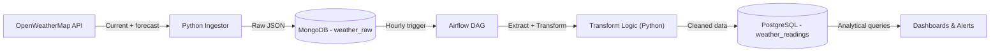

# SkyLogix Real-Time Weather Pipeline


## Project Overview
This pipeline automates the collection of weather data for SkyLogix Transportation's primary logistics corridors: Nairobi, Lagos, Accra, and Johannesburg.


## Data Architecture





## Tech Stack
- **Source:** OpenWeatherMap API 
- **Staging Layer:** MongoDB (weather_raw) 
- **Warehouse Layer:** PostgreSQL (weather_readings) 
- **Orchestration:** Apache Airflow 

## Setup Instructions
1. **Environment:** Create a `.env` file with your `MONGO_URI`, `POSTGRES_DB`, and OpenWeather `API_KEY`.
2. **Database:** Run `schema.sql` to create the PostgreSQL warehouse model.
3. **Airflow:** Place `skylogix_dag.py` in your Airflow DAGs folder.
4. **Execution:** Trigger the DAG via the Airflow UI to start the hourly ingestion.

### 1. Environment Variables

Create a `.env` file in the project root with the following content:

```env
# OpenWeatherMap API key (required)
API_KEY=your_openweathermap_key_here

# MongoDB connection string
# (use mongodb+srv://... if using MongoDB Atlas)
MONGO_URI=mongodb://localhost:27017/skylogix

# PostgreSQL warehouse connection details
POSTGRES_DB=skylogix_warehouse
POSTGRES_USER=your_username
POSTGRES_PASSWORD=your_secure_password
POSTGRES_HOST=localhost
POSTGRES_PORT=5432
```

### 2. Database Initialization

Create the required tables and schema in PostgreSQL by running the following command (adjust values to match your `.env` settings):

```bash
psql -h localhost -U your_username -d skylogix_warehouse -f schema.sql
```

### 3. Airflow Deployment

Copy the DAG file to your Airflow DAGs folder so that the scheduler can discover and load it:

```bash
# Copy the DAG file
# (adjust the path if your Airflow installation uses a different dags folder)
cp skylogix_dag.py ~/airflow/dags/
```

### 4. Run the Pipeline

Follow these steps to get the pipeline up and running:

1. **Start Airflow services**  
   Launch the webserver and scheduler in the background:

   ```bash
   airflow webserver --port 8080 &
   airflow scheduler 
   ```

**Alternative (Docker)**:  
If you're using Dockerized Airflow, simply run:
```bash
docker-compose up -d
```
2. **Access the Airflow UI**

   Open your browser and navigate to:  
   **http://localhost:8080**

   Default login credentials:  
   **Username**: admin  
   **Password**: admin

   > **Security note**: Change these default credentials immediately in any production or shared environment!

3. **Activate and test the DAG**

   - Locate the DAG in the Airflow UI  
     (confirm the exact name in your `skylogix_dag.py` file)

   - Toggle the switch on the left to **turn the DAG on**

   - Click the **Trigger DAG** button (play icon) to manually start a run and verify everything works as expected

The pipeline is configured to run **hourly** by default (controlled by the `schedule_interval` parameter in the DAG file).
## Analytics & Safety Insights

## Analytics

Sample queries for extreme condition detection (High wind/Rain) are included in the `analytics/` folder.


## Contributing

Contributions are welcome and greatly appreciated!

To make the process smooth for everyone, please follow these steps:

1. Open an issue first to discuss your idea, bug fix, or proposed feature
2. Once agreed, fork the repository and create your branch from `main`
3. Make your changes in a clear, focused way (one feature/fix per branch)
4. Add/update tests if applicable
5. Update documentation (README, comments, etc.) as needed
6. Submit a pull request with a clear title and description

Looking forward to your contributions!

## License

This project is licensed under the MIT License — see the [LICENSE](LICENSE) file for full details.

